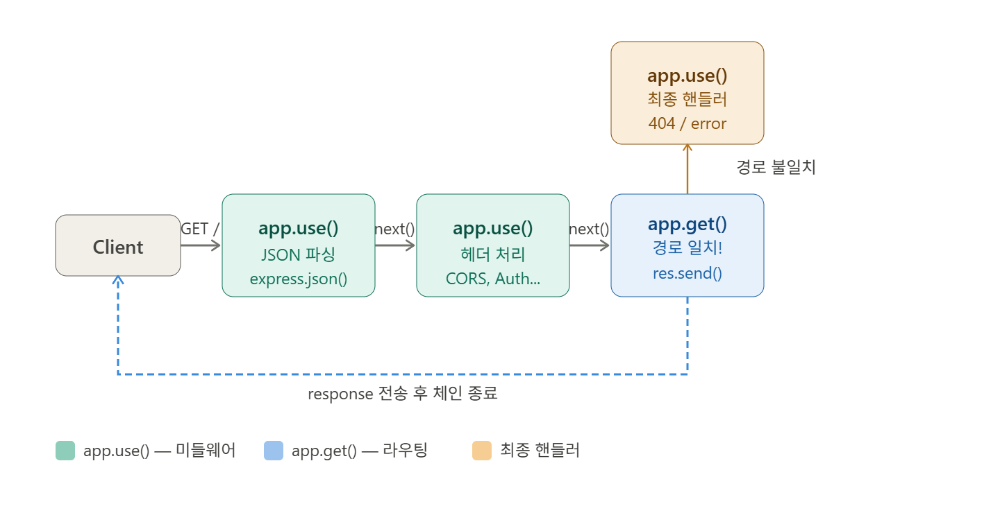
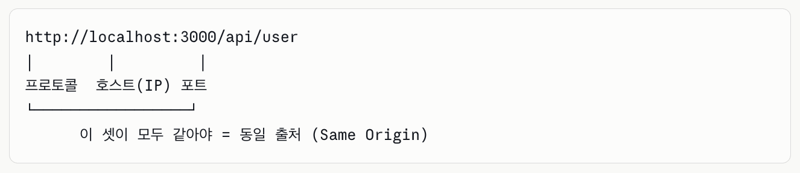
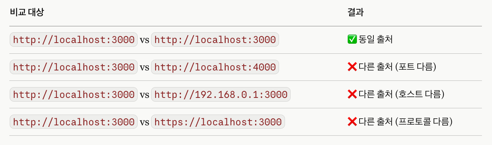

## 1. Express 소개

   
#### (1) State of JS 2025


   


#### (2) Express를 사용하는 이유
```
1) 검증된 생태계 - 사용자가 많다
2) 빠른 서버 생성
3) 가볍고 유연한 미들웨어 구조    
```

#### (3) Express.js 기본 라우팅과 CRUD API

##### 1) 라우팅이란?
```
클라이언트가 특정 URI(엔드포인트)로 요청을 보내면, 서버가 그 요청을 받아서 처리하는 방식을 정의하는 것이다.

예) http://localhost:8080/list  --> GET 메소드, /list 요청에 따른 라우팅 진행
```

##### 2) 라우팅 정의
```
1️⃣ express 모듈 import 및 생성
    예) const express = require('express');
        const app = express();

2️⃣ app 객체의 메서드로 HTTP 요청을 라우팅함
    예) app.get()       # R(Read)
        app.post()      # C(Create)
        app.put()       # U(Update)
        app.delete()    # D(Delete)

3️⃣ 라우팅 콜백 함수 정의
    (형식) app.get(경로, 콜백함수)
    예) app.get('/test', function(req, res, next()){
            res.send(...)
        })

    예) app.get('/test/:id', function(req, res, next()){
            res.send(...)
        })

4️⃣ express 서버 시작
    (형식) app.listen(포트번호, 콜백함수)
    예) app.listen(8080) 
```

##### 3) 라우팅 정의 실습 코드
```
//모듈 호출 및 인스턴스 생성
const express = require('express')
const app = express()


//데이터 요청(R)
app.get('/get', function(req, res, next) {
			res.send(...)
})

//데이터 생성(C)
app.post('/post', function(req, res, next) {
			res.send(...)
})

//데이터 수정(U)
app.put('/put', function(req, res, next) {
			res.send(...)
})

//데이터 삭제(D)
app.delete('/delete', function(req, res, next) {
			res.send(...)
})


//서버 실행
app.listen(8080)
```

#### (4) Express 미들웨어(Middleware)

##### 1) 미들웨어 체인 흐름


##### 2) 핵심 개념
```
🎯 미들웨어는 요청(Request)과 응답(Response) 사이에서 실행되는 함수입니다.

클라이언트 요청 → [미들웨어1] → [미들웨어2] → [미들웨어3] → 라우터 → 클라이언트

next()를 호출해야 다음 미들웨어로 넘어감, next() 생략시 자동으로 다음으로 이동

🎯 기본 구조
    app.use((req, res, next) => {
    // 처리 로직
    next(); // 다음 미들웨어로 전달
    });
```

##### 3) 미들웨어 종류
1️⃣ app.use(express.json())
```
- 역할 : JSON 형식으로 데이터를 보냈을 때
- 사용 : REST API(fetch, axios 등으로 보내는 JSON 데이터)
- Content-Type : application/json
```

- 클라이언트 JSON

```jsx
// 클라이언트가 이렇게 보내면:
fetch('/api', {
  method: 'POST',
  headers: { 'Content-Type': 'application/json' },
  body: JSON.stringify({ name: '홍길동' })
});
```

- 서버

```jsx
// 서버에서 req.body로 접근 가능:
app.use(express.json())

app.post('/api', (req, res) => {
  console.log(req.body.name); // '홍길동'
});
```

2️⃣ app.use(express.urlencoded({ extended: false }))
```
- 역할 : HTML Form 형식으로 데이터를 보냈을 때
- 사용 : <form method="POST"> 전송 시
- Content-Type : application/x-www-form-urlencoded
```

- 클라이언트 Form

```css
<!-- HTML Form -->
<form action="/login" method="POST">
  <input name="username" />
  <input name="password" type="password" />
  <button>로그인</button>
</form>
```

- 서버

```css
app.use(express.urlencoded({ extended: false }))

app.post('/login', (req, res) => {
  console.log(req.body.username); // form 입력값
});
```

3️⃣ app.use(express.static('public'))
```
- 역할 : 정적 파일을 자동으로 제공
- 사용 : HTML, CSS, 이미지, JS 파일 
- 폴더 : 프로젝트 루트의 public/ 폴더


프로젝트/
├── public/
│   ├── index.html   → http://localhost:3000/index.html
│   ├── style.css    → http://localhost:3000/style.css
│   └── logo.png     → http://localhost:3000/logo.png
└── app.js

```

4️⃣ CORS (Cross-Origin Resource Sharing) 미들웨어
##### (1)  CORS란?

> **"다른 출처(Origin)의 리소스를 요청할 때 브라우저가 적용하는 보안 정책"**
> 

**CORS는 브라우저에만 존재하는 정책**입니다.
→ Postman, curl, 서버 간 통신에서는 CORS 에러가 발생하지 않습니다.

##### (2)  Origin(출처)이란?




##### (3)  왜 CORS 정책이 존재할까?

브라우저가 **"허가된 출처만 리소스에 접근 가능"** 하도록 막아주는 것이 CORS의 목적입니다.

```jsx
[정상적인 요청]
사용자 → 내 사이트(mybank.com) → 서버 ✅

[CORS가 없다면?]
사용자 → 악성 사이트(hack.com) → mybank.com 서버 요청 가능! ❌
                                  (쿠키/세션 탈취 위험)
```

##### (4)  CORS 에러 발생 상황

```jsx
[클라이언트]  localhost:5500 (HTML/JS)
      ↓  fetch('/api/data') 요청
[서버]        localhost:3000 (Express)

→ 포트가 다름 → 브라우저가 CORS 차단! 🚫
```

- 에러 메시지
Access to fetch at 'http://localhost:3000/api'
from origin '[http://localhost:5500](http://localhost:5500/)'
has been blocked by CORS policy

##### (5)  CORS 해결 방법

방법 1. `cors` 패키지 사용 (가장 간단) ⭐

```jsx
npm i cors
```

```jsx
import express from "express";
***import cors from "cors";***

const PORT = 8000;
const server = express();

// 모든 출처 허용
***server.use(cors());*

// 특정 출처만 허용 (권장)**
***server.use(cors({
  origin: 'http://localhost:5500',  // 허용할 클라이언트 주소
  methods: ['GET', 'POST', 'PUT', 'DELETE'],
  credentials: true  // 쿠키 허용 시
}));***

server.use(express.json());
server.use(express.urlencoded({ extended: false }));
server.use(express.static("public"));

server.get("/", function (req, res, next) {
  res.send("express success!!!!");
});

server.listen(PORT, () => {
  console.log(`server running --->> ${PORT}`);
});

```

방법 2. 직접 헤더 설정

```jsx
app.use((req, res, next) => {
  res.setHeader('Access-Control-Allow-Origin', '*');
  res.setHeader('Access-Control-Allow-Methods', 'GET, POST, PUT, DELETE');
  res.setHeader('Access-Control-Allow-Headers', 'Content-Type');
  next();
});
```