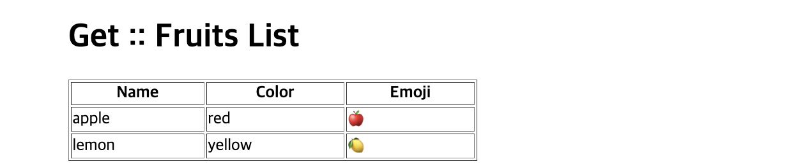
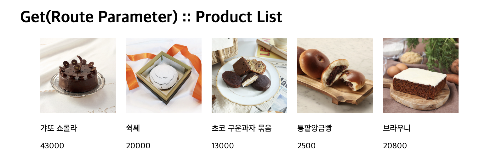
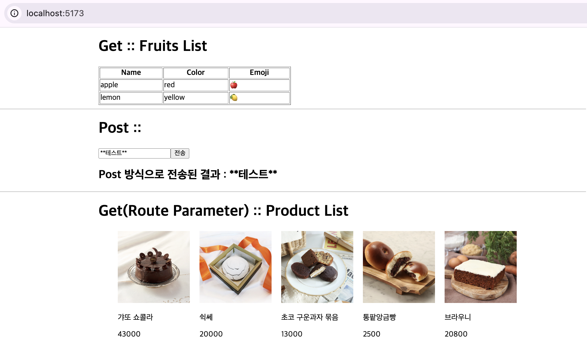

## 1. Express 라우팅

### (1) Express HTTP 요청 처리 및 라우팅 구조

1️⃣ HTTP 메서드 종류

```
예) app.get()       # R(Read)
    app.post()      # C(Create)
    app.put()       # U(Update)
    app.delete()    # D(Delete)
```

2️⃣ Route 콜백 함수 정의

```
(형식) app.get(경로, 콜백함수)
예) app.get('/test', function(req, res, next()){
        res.send(...)
    })
```

3️⃣ Route Parameter (Dynamic Route / Dynamic URL)

```
예) app.get('/test/:id', (req, res) => {
        res.send(req.params.id);
    });
```

### (2) Express 라우팅 실습

#### 1) Server 실습

1️⃣ server/App.js

```
//1. 라이브러리 임포트
import express from "express";
import cors from "cors";

//2. 익스프레스 서버 객체 생성
const PORT = 9000;
const app = express();

//3. 미들웨어
app.use(cors()); //모든 origin(프론트) 허용
app.use(express.json());
app.use(express.urlencoded({ extended: false }));

//4. 라우팅
app.get("/", (req, res, next) => {
  res.send("response -> server.js");
});

app.get("/api/get", (req, res, next) => {
  // console.log('/api/get 요청!!');
  const fruitList = [
    { name: "apple", color: "red", emoji: "🍎" },
    { name: "lemon", color: "yellow", emoji: "🍋" },
  ];
  res.json({ list: fruitList });
});

app.post("/api/post", (req, res, next) => {
  // console.log('/api/post 요청!!', req.body.name);
  res.json({ result: req.body.name });
});

app.get("/api/product/:pid", (req, res, next) => {
  res.json({ result: req.params.pid });
});

//5. 익스프레스 서버 객체 실행
app.listen(PORT, () => {
  console.log(`서버 실행 --->> ${PORT}`);
});

```

#### 2) Front 실습

1️⃣ components/CompGet.jsx



```
import { useState, useEffect } from "react";

export default function CompGet() {
  const [list, setList] = useState([]);
  useEffect(() => {
    const fetchData = async () => {
      const url = "http://localhost:9000/api/get";
      const response = await fetch(url, {
        method: "GET",
      });
      const jsonData = await response.json(); // list:[]
      setList(jsonData.list);
    };
    fetchData();
  }, []);

  return (
    <div style={{ width: "50%", margin: "auto" }}>
      <h1>Get :: Fruits List</h1>
      <table border="1" style={{ width: "400px" }}>
        <tr>
          <th>Name</th>
          <th>Color</th>
          <th>Emoji</th>
        </tr>
        {list?.map((fruit, idx) => (
          <tr key={idx}>
            <td>{fruit.name}</td>
            <td>{fruit.color}</td>
            <td>{fruit.emoji}</td>
          </tr>
        ))}
      </table>
    </div>
  );
}

```

2️⃣ components/CompPost.jsx


```
import { useState, useRef } from "react";

export default function CompPost() {
  const nameRef = useRef(null);
  const [data, setData] = useState(""); //서버 전송 데이터
  const [name, setName] = useState(""); //폼 입력 데이터

  const handleChange = () => {
    setName(nameRef.current.value);
  };

  const handlePost = async () => {
    const url = "http://localhost:9000/api/post";
    const response = await fetch(url, {
      method: "POST",
      headers: { "Content-type": "application/json" },
      body: JSON.stringify({ name: name }),
    });
    const jsonData = await response.json();
    setData(jsonData.result);
  };

  /*
    useEffect(()=>{
        const fetchData = async () => {
            const url = 'http://localhost:9000/api/post';
            const response = await fetch(url, {
                method: 'POST',
                headers: {'Content-type': 'application/json'},
                body: JSON.stringify({"name":"Smith💖"})
            });
            const jsonData = await response.json();
            setData(jsonData.result);
        }
        fetchData();
    }, []);
    */

  return (
    <div style={{ width: "50%", margin: "auto" }}>
      <h1>Post :: </h1>
      <input
        type="text"
        name="name"
        value={name}
        ref={nameRef}
        onChange={handleChange}
      ></input>
      <button onClick={handlePost}>전송</button>
      <h2>Post 방식으로 전송된 결과 : {data} </h2>
    </div>
  );
}


```

3️⃣ components/CompGetParameter.jsx


```
import { useState, useEffect } from "react";

export default function CompGetParameter() {
  const [list, setList] = useState([]);

  useEffect(() => {
    const fetchData = async () => {
      const url = "http://localhost:5173/data/products.json";
      const response = await fetch(url);
      const jsonData = await response.json(); // list:[]
      setList(jsonData);
    };
    fetchData();
  }, []);

  const handleProductDetail = async (product) => {
    const url = `http://localhost:9000/api/product/${product.pid}`;
    const response = await fetch(url);
    const jsonData = await response.json();
    console.log("pid :: ", jsonData.result);
  };

  return (
    <div style={{ width: "50%", margin: "auto" }}>
      <h1>Get(Route Parameter) :: Product List</h1>
      <ul style={{ display: "flex", listStyle: "none", gap: "20px" }}>
        {list?.map((product) => (
          <li key={product.pid}>
             {
                handleProductDetail(product);
              }}
            />
            <p>{product.name}</p>
            <p>{product.price}</p>
          </li>
        ))}
      </ul>
    </div>
  );
}

```

4️⃣ src/App.jsx



```
// import React from "react";
import CompGet from "./components/CompGet.jsx";
import CompGetParameter from "./components/CompGetParameter.jsx";
import CompPost from "./components/CompPost.jsx";

export default function App() {
  return (
    <div>
      <CompGet />
      <hr />
      <CompPost />
      <hr />
      <CompGetParameter />
    </div>
  );
}

```
