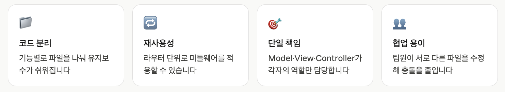
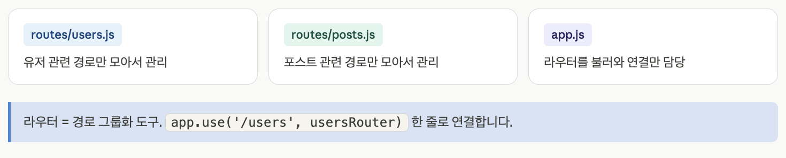
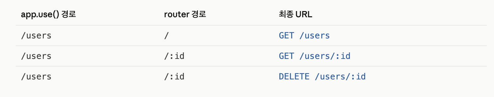
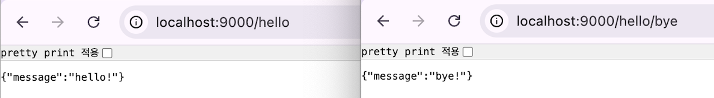
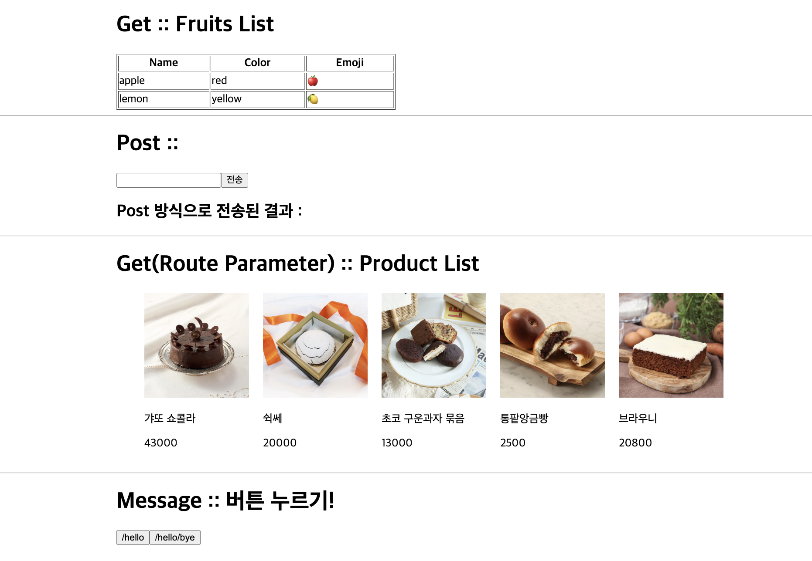

## 1. Express Router

### (1) 개요

- Express 앱이 커질수록 코드 분리가 필요합니다. Router로 경로를 묶고, MVC로 역할을 나눕니다.



### (2) Express Router

1️⃣ Router의 필요성

- 모든 경로를 app.js 하나에 쓰면 파일이 금방 수백 줄이 된다. express.Router()는 관련 경로를 하나의 파일로 묶어주는 미니 Express 앱이다. <br><br>

2️⃣ Router가 없는 경우

```
// app.js — 모든 게 한 파일에 ❌
app.get('/users', ...);
app.post('/users', ...);
app.get('/users/:id', ...);
app.get('/posts', ...);
app.post('/posts', ...);
app.get('/comments', ...);
// ... 수백 줄

```

3️⃣ Router 사용 후





4️⃣ Router 기본 구조

- routes/hello.js

```
import express from "express";

// 1. 라우터 생성
const router = express.Router();

// 2. 경로 등록
router.get("/", (req, res) => {
  res.json({ message: "hello!" });
});

router.get("/bye", (req, res) => {
  res.json({ message: "bye!" });
});

export default router; // 3. 내보내기

```

| export 방식          | import 방법                       |
| -------------------- | --------------------------------- |
| `export default`     | `import helloRouter from ...`     |
| `export const hello` | `import { hello } from ...`       |
| 별칭 사용            | `import { hello as helloRouter }` |

<br>
5️⃣ Router 연결

- App.js
- export default로 내보낸 경우는 자유롭게 이름을 정하면 된다.

```
// 라이브러리 임포트
import express from "express";
import cors from "cors";
import helloRouter from "./routes/hello.js";

// Router 연결
app.use("/hello", helloRouter);

```

### (3) Express Router 실습

1️⃣ routes/hello.js



```
import express from "express";

// 1. 라우터 생성
const router = express.Router();

// 2. 경로 등록
router.get("/", (req, res) => {
  res.json({ message: "hello!" });
});

router.get("/bye", (req, res) => {
  res.json({ message: "bye!" });
});

export default router; // 3. 내보내기

```

2️⃣ App.js

```
//1. 라이브러리 임포트
import express from "express";
import cors from "cors";
import helloRouter from "./routes/hello.js";

//2. 익스프레스 서버 객체 생성
const PORT = 9000;
const app = express();

//3. 미들웨어
app.use(cors()); //모든 origin(프론트) 허용
app.use(express.json());
app.use(express.urlencoded({ extended: false }));

// Router 연결
app.use("/hello", helloRouter);


//4. 라우팅
app.get("/", (req, res, next) => {
  res.send("response -> server.js");
});

app.get("/api/get", (req, res, next) => {
  const fruitList = [
    { name: "apple", color: "red", emoji: "🍎" },
    { name: "lemon", color: "yellow", emoji: "🍋" },
  ];
  res.json({ list: fruitList });
});

app.post("/api/post", (req, res, next) => {
  res.json({ result: req.body.name });
});

app.get("/api/product/:pid", (req, res, next) => {
  res.json({ result: req.params.pid });
});

//5. 익스프레스 서버 객체 실행
app.listen(PORT, () => {
  console.log(`서버 실행 --->> ${PORT}`);
});

```

3️⃣ components/Hello.jsx


```
import { useState } from "react";

export default function Hello() {
  const [message, setMessage] = useState("버튼 누르기!");

  const baseUrl = "http://localhost:9000/hello";
  const handleHello = async (type) => {
    const url = type === "end" ? `${baseUrl}/bye` : baseUrl;
    const response = await fetch(url);
    const jsonData = await response.json();
    setMessage(jsonData.message);
  };

  return (
    <div style={{ width: "50%", margin: "auto" }}>
      <h1>Message :: {message}</h1>
      <button onClick={() => handleHello("start")}>/hello</button>
      <button onClick={() => handleHello("end")}>/hello/bye</button>
    </div>
  );
}
```

<br>
4️⃣ src/App.jsx



```
// import React from "react";
import CompGet from "./components/CompGet.jsx";
import CompGetParameter from "./components/CompGetParameter.jsx";
import CompPost from "./components/CompPost.jsx";
import Hello from "./components/Hello.jsx";

export default function App() {
  return (
    <div>
      <CompGet />
      <hr />
      <CompPost />
      <hr />
      <CompGetParameter />
      <hr />
      <Hello />
    </div>
  );
}

```

<br>
5️⃣ src/App.jsx의 /api 라우팅 -> routes/api.js 변경

- routes/api.js

```
import express from "express";

// 1. 라우터 생성
const router = express.Router();

// 2. 경로 등록
router.get("/get", (req, res, next) => {
  const fruitList = [
    { name: "apple", color: "red", emoji: "🍎" },
    { name: "lemon", color: "yellow", emoji: "🍋" },
  ];
  res.json({ list: fruitList });
});

router.post("/post", (req, res, next) => {
  res.json({ result: req.body.name });
});

router.get("/product/:pid", (req, res, next) => {
  res.json({ result: req.params.pid });
});

export default router; // 3. 내보내기
```

- App.js

```
//1. 라이브러리 임포트
import express from "express";
import cors from "cors";
import helloRouter from "./routes/hello.js";
import apiRouter from "./routes/api.js";

//2. 익스프레스 서버 객체 생성
const PORT = 9000;
const app = express();

//3. 미들웨어
app.use(cors()); //모든 origin(프론트) 허용
app.use(express.json());
app.use(express.urlencoded({ extended: false }));

//4. Router 연결
app.use("/hello", helloRouter);
app.use("/api", apiRouter);

//5. 익스프레스 서버 객체 실행
app.listen(PORT, () => {
  console.log(`서버 실행 --->> ${PORT}`);
});

```
